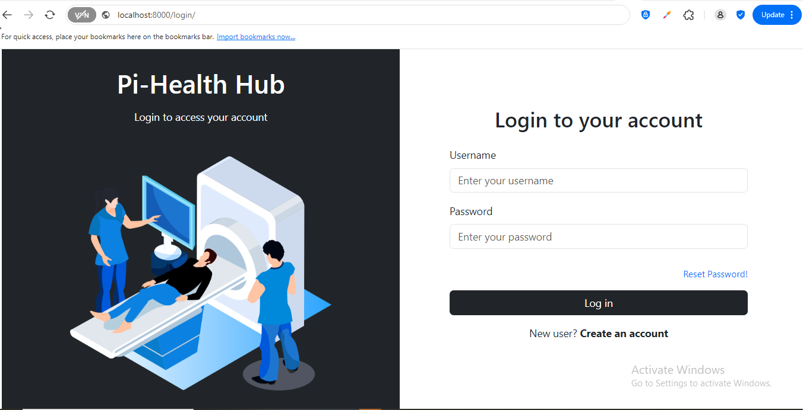

## How to Build a Custom Django Authentication System: A Comprehensive Guide.

**An authentication system is a critical component of any modern application**. 

This guide explains how to buildi a Django Login and Registration system using a **custom user model**. Unlike Django’s default authentication system, which requires a **predefined username** for authentication, a custom user model provides greater flexibility. It allows you to extend the base user functionality in various ways, such as using an **email address** as the primary identifier or implementing **custom validation rules** tailored to your application's needs.

C🔗 **Live Demo**: [Try it here](https://pihealth-pwx6.onrender.com/register/)  

📖 **Read the full article**: [Click here]()  

## 🛠️ How to Use  

1️⃣ **Clone the repository:**  

 ```sh
   git clone https://github.com/DoyinHubX/djangoCustomLoginAndRegistrationSystem.git
 ```

2️⃣ Navigate into the project folder:

 ```sh
   cd djangoCustomLoginAndRegistrationSystem
 ```

3️⃣ Install dependencies:

 ```sh
  pip install -r requirements.txt
 ```

4️⃣ Run database migrations:

 ```sh
  python manage.py migrate
 ```

5️⃣ Start the development server:

 ```sh
  python manage.py runserver
 ```
 
6️⃣ Access the app in your browser at: http://127.0.0.1:8000/


## 📷 Screenshot  

